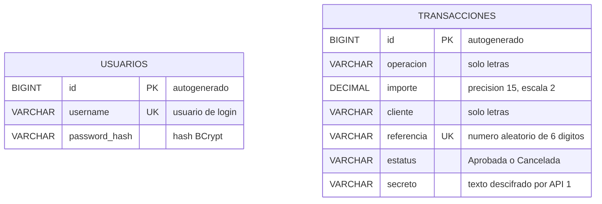

# Modelo entidad-relacion

La evaluacion pide dos bases H2 en memoria, una por API. No existe un campo que relacione una transaccion con un usuario en el PDF, por lo que se mantienen como dos modelos independientes. Agregar una FK de usuario a transaccion seria una mejora opcional, pero no un requisito.

## Motor y administracion del esquema

| API | Base H2 | Tabla | Archivo que crea el esquema | Verificacion |
| --- | --- | --- | --- | --- |
| API de entrada | `usuarios` | `usuarios` | `api-entrada/src/main/resources/schema.sql` | Hibernate valida el mapeo de `Usuario`. |
| API de transacciones | `transacciones` | `transacciones` | `api-transacciones/src/main/resources/schema.sql` | Hibernate valida el mapeo de `Transaccion`. |

Los scripts se ejecutan al iniciar las aplicaciones. La propiedad `spring.jpa.hibernate.ddl-auto=validate` evita que Hibernate altere el esquema automaticamente y hace fallar el arranque si el modelo Java no coincide con la base de datos.

Para inspeccion manual durante la demostracion, las consolas H2 estan disponibles en `http://localhost:8081/h2-console` y `http://localhost:8082/h2-console`. Usa respectivamente `jdbc:h2:mem:usuarios` y `jdbc:h2:mem:transacciones`, usuario `sa` y password vacio. Debes entrar mientras la API correspondiente siga encendida, porque las bases son en memoria.

## Reglas que se aplican en la aplicacion

- `id` es PK autogenerada.
- `username` y `referencia` son unicos.
- `importe` conserva dos decimales.
- El password solo se guarda como hash BCrypt, nunca en texto plano.
- El secreto llega cifrado a API 1; API 2 almacena su version descifrada, tal como solicita el PDF.
- La cancelacion busca por `id` y `referencia`, y solo actualiza registros `Aprobada` a `Cancelada`.
